# Meal Planner Graph Architecture

## Graph Overview

```mermaid
flowchart TD
    subgraph Main["Main Graph"]
        START((START))

        START -->|route_by_input| ROUTE{Input Type?}
        ROUTE -->|direct_url provided| create_meal_from_url
        ROUTE -->|cuisine_type provided| search_meals

        search_meals["🔍 search_meals<br/><small>DuckDuckGo search</small>"]
        parse_meals["📝 parse_meals<br/><small>LLM extracts recipes</small>"]
        validate_recipes["✅ validate_recipes<br/><small>Check URLs are valid</small>"]
        refine_search["🔄 refine_search<br/><small>Search specific dishes</small>"]
        present_options["📋 present_options<br/><small>⚡ INTERRUPT</small>"]
        create_meal_from_url["🔗 create_meal_from_url<br/><small>Create MealOption from URL</small>"]

        search_meals --> parse_meals
        parse_meals --> validate_recipes
        validate_recipes -->|should_refine| REFINE{Enough recipes?}
        REFINE -->|No, need more| refine_search
        REFINE -->|Yes| present_options
        refine_search --> validate_recipes

        present_options --> process_meal
        create_meal_from_url --> process_meal

        subgraph process_meal["process_meal (Subgraph)"]
            SUB_START((START))
            extract_ingredients["🥕 extract_ingredients<br/><small>Fetch & parse recipe</small>"]
            review_ingredients["📝 review_ingredients<br/><small>⚡ INTERRUPT</small>"]
            add_to_reminders["📱 add_to_reminders<br/><small>⚡ INTERRUPT</small>"]
            SUB_END((END))

            SUB_START --> extract_ingredients
            extract_ingredients --> review_ingredients
            review_ingredients --> add_to_reminders
            add_to_reminders --> SUB_END
        end

        process_meal --> END((END))
    end

    style present_options fill:#ffeb3b,stroke:#f57f17
    style review_ingredients fill:#ffeb3b,stroke:#f57f17
    style add_to_reminders fill:#ffeb3b,stroke:#f57f17
```



## SSE Events by Node

| Node | SSE Event | Description |
|------|-----------|-------------|
| `search_meals` | `status` | "Searching for recipes..." |
| `parse_meals` | `status` | "Parsing search results..." |
| `validate_recipes` | `status` | "Validating recipe URLs..." |
| `refine_search` | `status` | "Refining search with specific dishes..." |
| `present_options` | `status` | "Preparing meal options..." |
| **`present_options`** | **`meal_options`** | ⚡ Interrupt - User selects a recipe |
| `create_meal_from_url` | `status` | (minimal) |
| `extract_ingredients` | `status` | "Extracting ingredients from recipe..." |
| **`review_ingredients`** | **`ingredient_review`** | ⚡ Interrupt - User approves/removes ingredients |
| **`add_to_reminders`** | **`reminders_prompt`** | ⚡ Interrupt - User selects reminder list |
| (completion) | `grocery_list` | Final list of items (if successful) |
| (completion) | `complete` | Final summary with meal + list + status |
| (error) | `error` | Error message (e.g., fetch failed) |

## Interrupt Details

### 1. `present_options` → `meal_options`
```json
{
  "options": [{"id": 1, "name": "...", "description": "...", "recipe_url": "..."}],
  "prompt": "Select a meal:",
  "instruction": "Enter a number 1-5 to select a recipe"
}
```
**Resume with:** Recipe ID (e.g., `"1"`)

### 2. `review_ingredients` → `ingredient_review`
```json
{
  "ingredients": [{"name": "chicken", "amount": "2", "unit": "lbs"}],
  "prompt": "Review ingredients:",
  "instruction": "Enter 'ok' to approve or 'remove X, Y, Z' to remove items"
}
```
**Resume with:** `"ok"` or `"remove chicken, salt"`

### 3. `add_to_reminders` → `reminders_prompt`
```json
{
  "existing_lists": ["Groceries", "Shopping"],
  "items": [{"name": "chicken", "amount": "2", "unit": "lbs"}],
  "instruction": "Enter list number, new list name, or 'skip'"
}
```
**Resume with:** List number, new name, or `"skip"`

## State Flow


## Graph State (`MealPlannerState`)

The graph state is a `TypedDict` that accumulates data as nodes execute. Each node reads specific fields and returns updates that get merged into the state.

### State Fields

| Field | Type | Description |
|-------|------|-------------|
| `direct_url` | `Optional[str]` | Direct recipe URL (skips search flow) |
| `cuisine_type` | `str` | User's cuisine preference (e.g., "italian") |
| `preferred_sources` | `Optional[List[str]]` | Preferred recipe websites |
| `search_results` | `Optional[str]` | Raw DuckDuckGo search results |
| `meal_options` | `Optional[List[MealOption]]` | Parsed recipe options for selection |
| `selected_meal` | `Optional[MealOption]` | User's chosen recipe |
| `messages` | `List` | LangChain message history |
| `refinement_count` | `int` | Number of search refinement iterations |
| `refine_dishes` | `Optional[List[str]]` | Specific dish names for refined search |
| `grocery_list` | `Optional[List[Ingredient]]` | Extracted/approved ingredients |
| `reminders_added` | `Optional[bool]` | Whether items were added to Reminders |
| `error` | `Optional[str]` | Error message to surface to UI |

### State Updates by Node

```mermaid
flowchart LR
    subgraph Initial["Initial State (from request)"]
        init["cuisine_type<br/>direct_url<br/>preferred_sources"]
    end

    subgraph Search["Search Flow"]
        search_meals["<b>search_meals</b><br/>━━━━━━━━━━━<br/>reads: cuisine_type<br/>writes: search_results"]
        parse_meals["<b>parse_meals</b><br/>━━━━━━━━━━━<br/>reads: search_results, cuisine_type<br/>writes: meal_options, messages"]
        validate["<b>validate_recipes</b><br/>━━━━━━━━━━━<br/>reads: meal_options, cuisine_type, refinement_count<br/>writes: meal_options, refinement_count, refine_dishes"]
        refine["<b>refine_search</b><br/>━━━━━━━━━━━<br/>reads: cuisine_type, preferred_sources, refine_dishes, meal_options<br/>writes: meal_options, search_results, refine_dishes"]
        present["<b>present_options</b><br/>━━━━━━━━━━━<br/>reads: meal_options, cuisine_type<br/>writes: selected_meal"]
    end

    subgraph Direct["Direct URL Flow"]
        create["<b>create_meal_from_url</b><br/>━━━━━━━━━━━<br/>reads: direct_url<br/>writes: meal_options, selected_meal"]
    end

    subgraph Process["Meal Processing (Subgraph)"]
        extract["<b>extract_ingredients</b><br/>━━━━━━━━━━━<br/>reads: selected_meal<br/>writes: grocery_list, error"]
        review["<b>review_ingredients</b><br/>━━━━━━━━━━━<br/>reads: grocery_list<br/>writes: grocery_list"]
        reminders["<b>add_to_reminders</b><br/>━━━━━━━━━━━<br/>reads: grocery_list<br/>writes: reminders_added"]
    end

    init --> search_meals
    init --> create
    search_meals --> parse_meals --> validate --> refine
    validate --> present
    refine --> validate
    present --> extract
    create --> extract
    extract --> review --> reminders
```



### Detailed Node State Access

#### `search_meals`
```python
# Reads
cuisine = state["cuisine_type"]

# Writes
return {"search_results": results}
```

#### `parse_meals`
```python
# Reads
search_results = state["search_results"]
cuisine = state["cuisine_type"]

# Writes
return {
    "meal_options": meal_options,
    "messages": [AIMessage(content=display_text)]
}
```

#### `validate_recipes`
```python
# Reads
meal_options = state["meal_options"]
cuisine = state["cuisine_type"]
refinement_count = state.get("refinement_count", 0)

# Writes (varies by condition)
return {"meal_options": valid_recipes}
# OR
return {
    "meal_options": valid_recipes,
    "refinement_count": refinement_count + 1,
    "refine_dishes": dish_names[:5]
}
```

#### `refine_search`
```python
# Reads
cuisine = state["cuisine_type"]
sources = state.get("preferred_sources", [])
dish_names = state.get("refine_dishes", [])
existing_valid = state.get("meal_options", [])

# Writes
return {
    "meal_options": unique_recipes[:5],
    "search_results": combined_results,
    "refine_dishes": None  # Clear to exit refinement loop
}
```

#### `present_options` ⚡ INTERRUPT
```python
# Reads
meal_options = state["meal_options"]
cuisine = state["cuisine_type"]

# Interrupt (waits for user input)
user_selection = interrupt(value={...})

# Writes
return {"selected_meal": selected}
```

#### `create_meal_from_url`
```python
# Reads
url = state["direct_url"]

# Writes
return {
    "meal_options": [meal],
    "selected_meal": meal  # Auto-selected
}
```

#### `extract_ingredients`
```python
# Reads
selected_meal = state["selected_meal"]

# Writes (success)
return {"grocery_list": ingredients}
# OR (error)
return {"grocery_list": [], "error": error_msg}
```

#### `review_ingredients` ⚡ INTERRUPT
```python
# Reads
ingredients = state.get("grocery_list", [])

# Interrupt (waits for user input)
user_input = interrupt(value={...})

# Writes
return {"grocery_list": filtered_ingredients}
```

#### `add_to_reminders` ⚡ INTERRUPT
```python
# Reads
ingredients = state.get("grocery_list", [])

# Interrupt (waits for user input)
list_input = interrupt(value={...})

# Writes
return {"reminders_added": True}  # or False
```

### State Progression Example (Search Flow)

```
┌─────────────────────────────────────────────────────────────────────────────┐
│ Initial State                                                               │
├─────────────────────────────────────────────────────────────────────────────┤
│ cuisine_type: "italian"                                                     │
│ direct_url: null                                                            │
│ preferred_sources: ["bonappetit.com"]                                       │
│ (all other fields: null/empty)                                              │
└─────────────────────────────────────────────────────────────────────────────┘
                                    │
                                    ▼ search_meals
┌─────────────────────────────────────────────────────────────────────────────┐
│ + search_results: "snippet: Best Pasta Recipes... link: bonappetit.com..."  │
└─────────────────────────────────────────────────────────────────────────────┘
                                    │
                                    ▼ parse_meals
┌─────────────────────────────────────────────────────────────────────────────┐
│ + meal_options: [MealOption(id=1, name="Cacio e Pepe", ...), ...]           │
│ + messages: [AIMessage(...)]                                                │
└─────────────────────────────────────────────────────────────────────────────┘
                                    │
                                    ▼ validate_recipes
┌─────────────────────────────────────────────────────────────────────────────┐
│ ~ meal_options: [MealOption(...), ...] (filtered to valid only)             │
└─────────────────────────────────────────────────────────────────────────────┘
                                    │
                                    ▼ present_options ⚡ INTERRUPT
┌─────────────────────────────────────────────────────────────────────────────┐
│ + selected_meal: MealOption(id=2, name="Pasta Carbonara", recipe_url=...)   │
└─────────────────────────────────────────────────────────────────────────────┘
                                    │
                                    ▼ extract_ingredients
┌─────────────────────────────────────────────────────────────────────────────┐
│ + grocery_list: [Ingredient(name="spaghetti", amount="1", unit="lb"), ...]  │
└─────────────────────────────────────────────────────────────────────────────┘
                                    │
                                    ▼ review_ingredients ⚡ INTERRUPT
┌─────────────────────────────────────────────────────────────────────────────┐
│ ~ grocery_list: [...] (possibly filtered by user)                           │
└─────────────────────────────────────────────────────────────────────────────┘
                                    │
                                    ▼ add_to_reminders ⚡ INTERRUPT
┌─────────────────────────────────────────────────────────────────────────────┐
│ + reminders_added: true                                                     │
└─────────────────────────────────────────────────────────────────────────────┘
```

## Error Handling

Errors set `state.error` and flow continues to completion, where the server checks:

```python
if error:
    yield sse_event("error", {"message": error})
    return  # Don't send "complete"
```

Current error points:
- `extract_ingredients`: Recipe fetch fails (403, timeout, etc.)
