# Meal Planner Graph Architecture

## Graph Overview

```mermaid
flowchart TD
    subgraph Main["Main Graph"]
        START((START))

        START -->|route_by_input| ROUTE{Input Type?}
        ROUTE -->|direct_url provided| create_meal_from_url
        ROUTE -->|cuisine_type provided| search_meals

        search_meals["🔍 search_meals<br/><small>DuckDuckGo search</small>"]
        parse_meals["📝 parse_meals<br/><small>LLM extracts recipes</small>"]
        validate_recipes["✅ validate_recipes<br/><small>Check URLs are valid</small>"]
        refine_search["🔄 refine_search<br/><small>Search specific dishes</small>"]
        present_options["📋 present_options<br/><small>⚡ INTERRUPT</small>"]
        create_meal_from_url["🔗 create_meal_from_url<br/><small>Create MealOption from URL</small>"]

        search_meals --> parse_meals
        parse_meals --> validate_recipes
        validate_recipes -->|should_refine| REFINE{Enough recipes?}
        REFINE -->|No, need more| refine_search
        REFINE -->|Yes| present_options
        refine_search --> validate_recipes

        present_options --> process_meal
        create_meal_from_url --> process_meal

        subgraph process_meal["process_meal (Subgraph)"]
            SUB_START((START))
            extract_ingredients["🥕 extract_ingredients<br/><small>Fetch & parse recipe</small>"]
            review_ingredients["📝 review_ingredients<br/><small>⚡ INTERRUPT</small>"]
            add_to_reminders["📱 add_to_reminders<br/><small>⚡ INTERRUPT</small>"]
            SUB_END((END))

            SUB_START --> extract_ingredients
            extract_ingredients --> review_ingredients
            review_ingredients --> add_to_reminders
            add_to_reminders --> SUB_END
        end

        process_meal --> END((END))
    end

    style present_options fill:#ffeb3b,stroke:#f57f17
    style review_ingredients fill:#ffeb3b,stroke:#f57f17
    style add_to_reminders fill:#ffeb3b,stroke:#f57f17
```



## SSE Events by Node

| Node | SSE Event | Description |
|------|-----------|-------------|
| `search_meals` | `status` | "Searching for recipes..." |
| `parse_meals` | `status` | "Parsing search results..." |
| `validate_recipes` | `status` | "Validating recipe URLs..." |
| `refine_search` | `status` | "Refining search with specific dishes..." |
| `present_options` | `status` | "Preparing meal options..." |
| **`present_options`** | **`meal_options`** | ⚡ Interrupt - User selects a recipe |
| `create_meal_from_url` | `status` | (minimal) |
| `extract_ingredients` | `status` | "Extracting ingredients from recipe..." |
| **`review_ingredients`** | **`ingredient_review`** | ⚡ Interrupt - User approves/removes ingredients |
| **`add_to_reminders`** | **`reminders_prompt`** | ⚡ Interrupt - User selects reminder list |
| (completion) | `grocery_list` | Final list of items (if successful) |
| (completion) | `complete` | Final summary with meal + list + status |
| (error) | `error` | Error message (e.g., fetch failed) |

## Interrupt Details

### 1. `present_options` → `meal_options`
```json
{
  "options": [{"id": 1, "name": "...", "description": "...", "recipe_url": "..."}],
  "prompt": "Select a meal:",
  "instruction": "Enter a number 1-5 to select a recipe"
}
```
**Resume with:** Recipe ID (e.g., `"1"`)

### 2. `review_ingredients` → `ingredient_review`
```json
{
  "ingredients": [{"name": "chicken", "amount": "2", "unit": "lbs"}],
  "prompt": "Review ingredients:",
  "instruction": "Enter 'ok' to approve or 'remove X, Y, Z' to remove items"
}
```
**Resume with:** `"ok"` or `"remove chicken, salt"`

### 3. `add_to_reminders` → `reminders_prompt`
```json
{
  "existing_lists": ["Groceries", "Shopping"],
  "items": [{"name": "chicken", "amount": "2", "unit": "lbs"}],
  "instruction": "Enter list number, new list name, or 'skip'"
}
```
**Resume with:** List number, new name, or `"skip"`

## State Flow


## Error Handling

Errors set `state.error` and flow continues to completion, where the server checks:

```python
if error:
    yield sse_event("error", {"message": error})
    return  # Don't send "complete"
```

Current error points:
- `extract_ingredients`: Recipe fetch fails (403, timeout, etc.)
